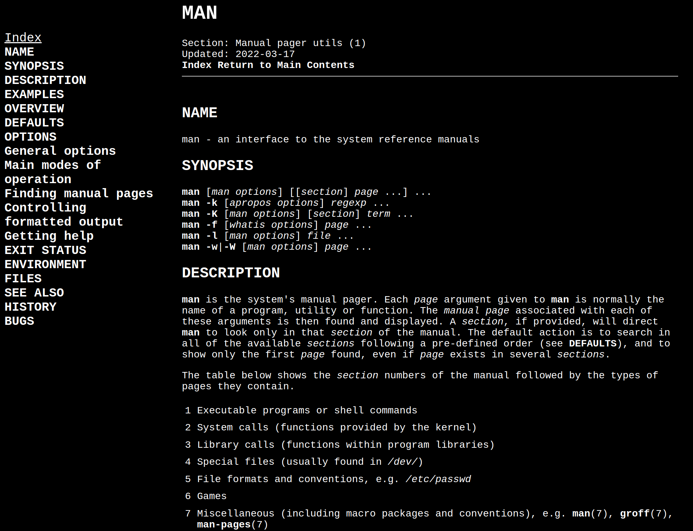
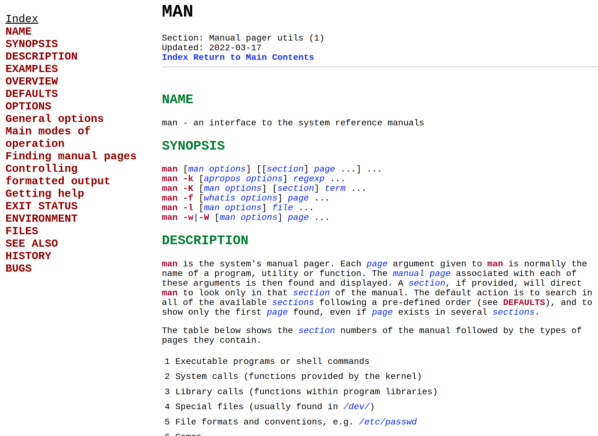
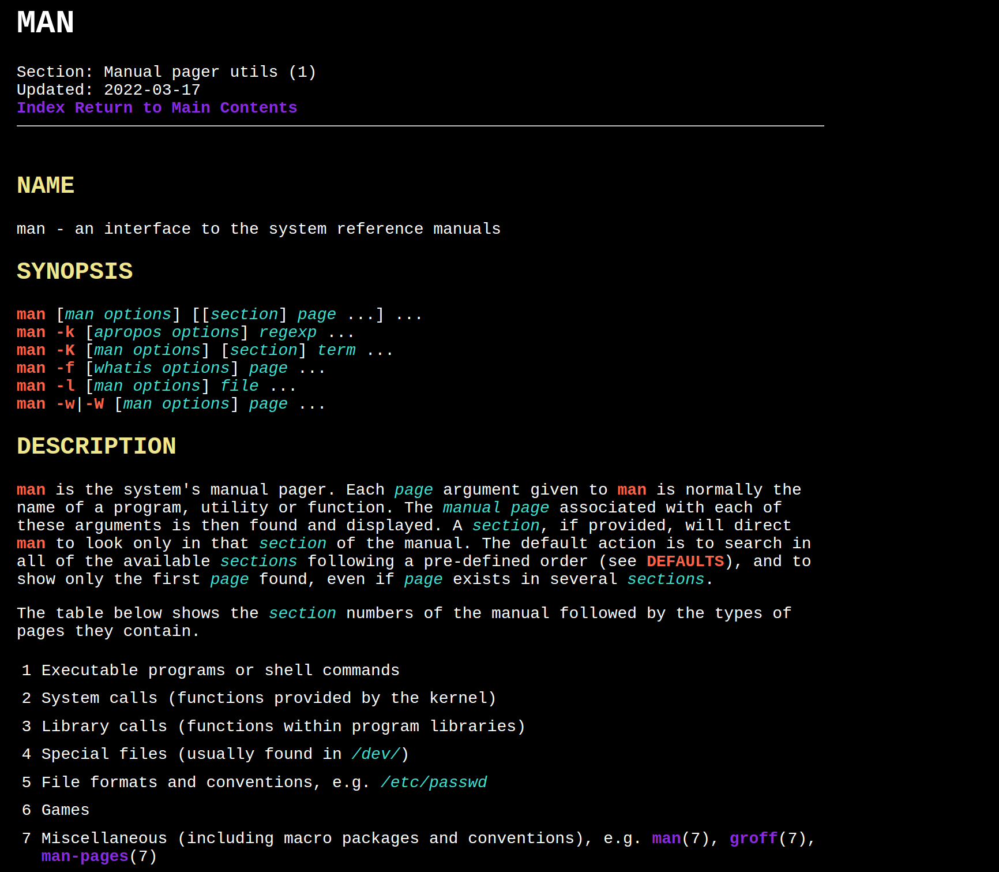

# Man Page Server

View your local man pages in the browser.

https://github.com/Castersen/man_server_python/assets/90943238/7d9e031b-f1c7-4466-ac3b-1f24c182e471

Supports various themes, follows links, caches converted pages, supports possibilities, shows potential man pages if section is wrong.

## Dependencies 

python3.10+

<b>Linux</b>  
man2html  
man  
manpath

<b>Mac</b>  
mandoc  
man  
manpath

## How to use

`python3 man_server.py`  

By default this starts up a TCP server at port 8000,
from there you can open your browser and direct it to <b>localhost:8000</b> and begin browsing man pages.

To change the port

`python3 man_server.py -p [port]`

To change the theme

`python3 man_server.py -t [theme]`

To see all options

`python3 man_server.py -h`

## Themes

<b>default</b>: This is a simple black and white terminal style theme and is the theme used if `-t` is not set

<b>light</b>

<b>tropical-dust</b>: (linux only) Dark theme with highlighting, does not include side nav bar

## Creating New Themes

Simply navigate to the themes directory, and copy one of the existing themes, renaming it to whatever you would like the new theme to be called. Then modify the css file save it and run:

`python3 man_server.py -t [new_theme_name]`

Of course you can just generate your own css file from scratch but modifying one of the existing ones gives a better idea of what parts should be modified. Ultimately, have fun!

## Displaying Possibilities

One of the most useful aspects of the terminal is being able to press tab and get suggestions or autocomplete. This feature is supported directly in the browser. For example if you want to see all the man pages that start with mem just type mem and press tab. This also shows the section of that man page so if a page has multiple sections you can see all of them. This works by calling `manpath -q` for the directories man will look in and grabbing all the files within those directories. This is only done once. If you install a library or gain additional man pages you will need to run:

`python3 man_server.py -r`

This will refresh the file that contains all of the names. You will also have to clear localstorage in your browser and refresh to fetch the new file names.

Pressing tab with an empty input buffer will display all man page names and sections.

Example (typing mem and pressing tab)

<image src="showcase/autocomplete.png"/>

## Internals

Converting the man pages to html is done by <b>mandoc</b> (mac) or <b>man2html</b> (linux) the pages themselves are found using <b>man -wa</b> and then parsing the output for the correct section. Every time a page is converted it is stored in the cache directory and subsequently retrieved from there. This means if a man page is updated and you want to view the newest version you must clear the cache (`rm cache/*.html`).

The output is then post processed before being sent to the client. This involves reading the index to generate the side view for easy access. Then <b>template.html</b> is read and the relevant parts of the man page are placed in the template. This is where the themes are loaded.

## Tests

Tests are found in <b>test.py</b> they should only be run when the server is not running. An instance of the server is spawned and requests are sent to it to verify that it is working. Calls are also made to the man_parser.

To run tests:

`python3 tests.py`
